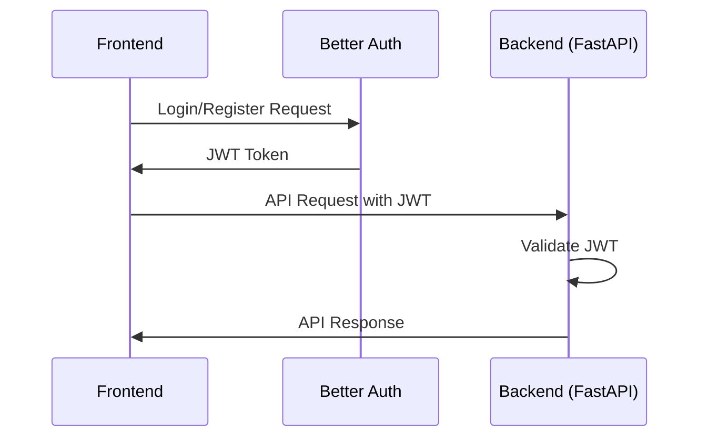

# Todo Project Phase 2 - Architecture Plan

## 1. Database Design

### User Model
```python
from sqlmodel import SQLModel, Field, Relationship
from typing import Optional, List
from datetime import datetime
import uuid

class UserBase(SQLModel):
    email: str = Field(unique=True, index=True)
    first_name: Optional[str] = None
    last_name: Optional[str] = None

class User(UserBase, table=True):
    id: uuid.UUID = Field(default_factory=uuid.uuid4, primary_key=True)
    email: str = Field(unique=True, index=True)
    password_hash: str
    created_at: datetime = Field(default_factory=datetime.utcnow)
    updated_at: datetime = Field(default_factory=datetime.utcnow)
    
    # Relationship to todos
    todos: List["Todo"] = Relationship(back_populates="user")

class UserRead(UserBase):
    id: uuid.UUID
    created_at: datetime
    updated_at: datetime

class UserCreate(UserBase):
    email: str
    password: str

class UserUpdate(SQLModel):
    first_name: Optional[str] = None
    last_name: Optional[str] = None
```

### Todo Model
```python
from sqlmodel import SQLModel, Field, Relationship
from typing import Optional
from datetime import datetime
import uuid

class TodoBase(SQLModel):
    title: str
    description: Optional[str] = None
    due_date: Optional[datetime] = None
    completed: bool = False
    priority: str = Field(default="medium", regex="^(low|medium|high)$")  # low, medium, high

class Todo(TodoBase, table=True):
    id: uuid.UUID = Field(default_factory=uuid.uuid4, primary_key=True)
    user_id: uuid.UUID = Field(foreign_key="user.id")
    
    created_at: datetime = Field(default_factory=datetime.utcnow)
    updated_at: datetime = Field(default_factory=datetime.utcnow)
    
    # Relationship to user
    user: "User" = Relationship(back_populates="todos")

class TodoRead(TodoBase):
    id: uuid.UUID
    user_id: uuid.UUID
    created_at: datetime
    updated_at: datetime

class TodoCreate(TodoBase):
    title: str

class TodoUpdate(SQLModel):
    title: Optional[str] = None
    description: Optional[str] = None
    due_date: Optional[datetime] = None
    completed: Optional[bool] = None
    priority: Optional[str] = Field(default=None, regex="^(low|medium|high)$")
```

## 2. Backend Architecture

### FastAPI Router Structure
```
backend/
├── app/
│   ├── main.py                 # Application entry point
│   ├── api/                    # API routes
│   │   ├── __init__.py
│   │   ├── deps.py             # Dependency injection
│   │   ├── auth.py             # Authentication endpoints
│   │   ├── todos.py            # Todo endpoints
│   │   └── users.py            # User endpoints
│   ├── models/                 # SQLModel models
│   │   ├── __init__.py
│   │   ├── user.py
│   │   └── todo.py
│   ├── schemas/                # Pydantic schemas
│   │   ├── __init__.py
│   │   ├── user.py
│   │   ├── todo.py
│   │   └── auth.py
│   ├── database/               # Database configuration
│   │   ├── __init__.py
│   │   ├── engine.py
│   │   └── session.py
│   ├── auth/                   # Authentication logic
│   │   ├── __init__.py
│   │   └── security.py
│   └── config/                 # Configuration settings
│       ├── __init__.py
│       └── settings.py
```

### JWT Middleware Logic
```python
from fastapi import HTTPException, Depends
from fastapi.security import HTTPBearer, HTTPAuthorizationCredentials
from sqlalchemy.ext.asyncio import AsyncSession
from app.database.session import get_session
from app.auth.security import decode_access_token
from app.models.user import User

security = HTTPBearer()

async def get_current_user(
    credentials: HTTPAuthorizationCredentials = Depends(security),
    session: AsyncSession = Depends(get_session)
) -> User:
    token = credentials.credentials
    user_id = decode_access_token(token)
    
    if not user_id:
        raise HTTPException(
            status_code=401,
            detail="Invalid or expired token"
        )
    
    user = await session.get(User, user_id)
    if not user:
        raise HTTPException(
            status_code=401,
            detail="User not found"
        )
    
    return user
```

## 3. Frontend Architecture

### Component Hierarchy
```
frontend/
├── pages/                      # Next.js pages
│   ├── index.tsx              # Home/Dashboard page
│   ├── auth/                  # Authentication pages
│   │   ├── login.tsx
│   │   └── register.tsx
│   └── dashboard/             # Dashboard pages
│       ├── index.tsx          # Main dashboard
│       └── [todoId].tsx       # Todo detail page
├── components/                # Reusable components
│   ├── layout/                # Layout components
│   │   ├── MainLayout.tsx     # Main application layout
│   │   ├── Header.tsx         # Application header
│   │   ├── Sidebar.tsx        # Navigation sidebar
│   │   └── Footer.tsx         # Application footer
│   ├── ui/                    # UI components
│   │   ├── Button.tsx         # Button component
│   │   ├── Input.tsx          # Input component
│   │   ├── Card.tsx           # Card component
│   │   ├── Modal.tsx          # Modal component
│   │   └── Form.tsx           # Form component
│   ├── auth/                  # Authentication components
│   │   ├── LoginForm.tsx      # Login form component
│   │   ├── RegisterForm.tsx   # Registration form component
│   │   └── ProtectedRoute.tsx # Route protection component
│   ├── todo/                  # Todo-specific components
│   │   ├── TodoList.tsx       # List of todos
│   │   ├── TodoItem.tsx       # Individual todo item
│   │   ├── TodoForm.tsx       # Form for creating/updating todos
│   │   ├── TodoFilter.tsx     # Todo filtering component
│   │   └── TodoStats.tsx      # Todo statistics component
│   └── navigation/            # Navigation components
│       ├── Navbar.tsx         # Main navigation
│       └── Breadcrumbs.tsx    # Breadcrumb navigation
```

### Key Components Description
- **MainLayout**: Wraps all pages with consistent header, sidebar, and footer
- **Sidebar**: Navigation menu with links to different sections
- **TaskList**: Displays todos with filtering and sorting options
- **AuthForm**: Handles login and registration forms with validation

## 4. Branding Implementation Plan

### Tailwind CSS Classes
- **White Background**: `bg-white` for all main content areas
- **Purple Buttons**: `bg-purple-600` for primary action buttons
- **Pink Details**: `text-pink-500` for accents, highlights, and secondary elements

### Specific Implementation
```jsx
// Example button component with branding
const PrimaryButton = ({ children, onClick }) => (
  <button 
    className="bg-purple-600 hover:bg-purple-700 text-white font-medium py-2 px-4 rounded-md transition-colors"
    onClick={onClick}
  >
    {children}
  </button>
);

// Example of pink detailing
const TodoItem = ({ todo }) => (
  <div className="bg-white p-4 border border-gray-200 rounded-lg">
    <h3 className="font-medium">{todo.title}</h3>
    <p className="text-pink-500 text-sm mt-1">{todo.description}</p>
  </div>
);
```

### Global Styles
- Apply `bg-white` to main layout containers
- Use `bg-purple-600` for primary buttons and important CTAs
- Use `text-pink-500` for links, accents, and highlighting important information
- Ensure consistent spacing and typography across all components

## 5. Auth Flow

### Better Auth Integration with FastAPI Backend
1. **Frontend Authentication**:
   - Use Better Auth client-side library for login/register forms
   - Store JWT tokens in browser's secure storage (httpOnly cookies or secure localStorage)

2. **Backend Token Validation**:
   - FastAPI endpoints validate JWT tokens using middleware
   - Extract user information from token payload
   - Verify token signature and expiration

3. **Communication Flow**:
   - Frontend sends auth requests to Better Auth endpoints
   - Better Auth handles user registration/login and returns JWT
   - Frontend includes JWT in Authorization header for API requests to FastAPI
   - FastAPI validates JWT and processes requests based on user permissions

4. **Token Management**:
   - Implement token refresh mechanism
   - Handle token expiration gracefully
   - Secure token storage and transmission

### API Authentication Flow
